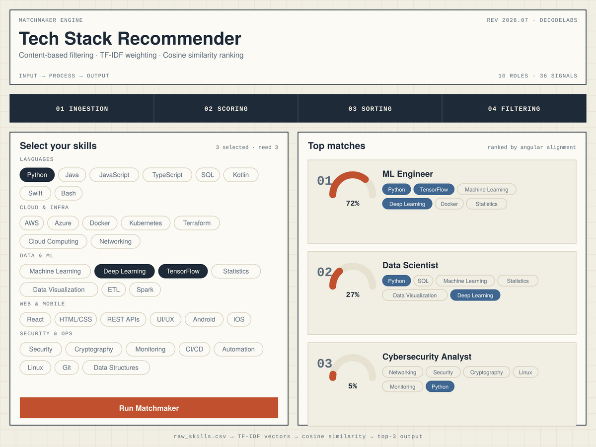

# Tech Stack Recommender

A content-based recommendation engine that maps a user's skills to their best-fit tech career path — built for DecodeLabs' **AI Project 3: AI Recommendation Logic**.

No frameworks, no backend, no ML libraries. Just TF‑IDF vectorization and cosine similarity, implemented from scratch in vanilla JavaScript, wrapped in a single-page GUI.



## What it does

You select at least 3 skills from a categorized list. The engine treats 10 job roles as "items," builds TF‑IDF weighted vectors for you and for every role from a shared skill vocabulary, scores each role by the cosine of the angle between your vector and its vector, and returns your top 3 matches — each with a similarity gauge and the specific skills that drove the match.

## Why it's built this way

The brief specifically calls for a particular architecture, not just "any recommender":

| Requirement | Implementation |
|---|---|
| Input → Process → Output model | Skill picker → TF‑IDF + cosine scoring → ranked Top‑3 list |
| Content-based filtering (not collaborative) | Matches item *attributes* directly, no historical user data needed |
| TF‑IDF weighting (not raw binary overlap) | Common skills are down-weighted, distinctive skills are up-weighted |
| Cosine similarity (not Euclidean distance) | Scores are invariant to profile size — only the *direction* of interest matters |
| 4-step pipeline | Ingestion → Scoring → Sorting → Filtering, visualized as it runs |
| Minimum 3 inputs | "Run Matchmaker" stays disabled until 3+ skills are selected |

## The math, briefly

For a skill `t` and a document `d` (a role's skill list, or your own selection):

```
TF(t, d)  = count of t in d / total skills in d
IDF(t)    = log( total roles / roles containing t )
weight    = TF(t, d) × IDF(t)
```

Every role and the user profile become vectors over the same 36-skill vocabulary. Similarity is the cosine of the angle between two vectors:

```
cos(θ) = (A · B) / (‖A‖ ‖B‖)
```

Because TF‑IDF weights are non-negative, scores land cleanly between 0 (no shared signal) and 1 (perfect alignment) — shown directly on each result's arc gauge.

## Project structure

```
tech_stack_recommender.html   the app — open it in any browser, no build step
raw_skills.csv                dataset: job_role,skill pairs backing the engine
preview.png                   screenshot used above
README.md                     this file
```

## Running it

Just open `tech_stack_recommender.html` in a browser. Everything — dataset, vectorization, scoring — runs client-side in the `<script>` tag.

## The dataset

`raw_skills.csv` is a tidy long-format table:

```csv
job_role,skill
Data Scientist,Python
Data Scientist,SQL
...
```

10 roles × ~6 skills each, drawn from a shared 36-skill vocabulary across five categories (Languages, Cloud & Infra, Data & ML, Web & Mobile, Security & Ops). This is a self-authored stand-in dataset — the brief names `raw_skills.csv` as an example but doesn't provide one, so swap it for a real dataset if your course supplies one; the vectorization logic doesn't need to change, only the `ROLES` / `CATEGORIES` arrays at the top of the `<script>` tag.

## Extending it

- **Add a role:** append `{name, skills}` to `ROLES` in the script.
- **Add a skill:** add it to the right group in `CATEGORIES`, then reference it in any role's `skills` array.
- **Change Top‑N:** adjust `.slice(0, 3)` in `showResults()`.

## Credits

Built to spec from DecodeLabs' *Artificial Intelligence — Project 3: Industrial Training Kit* (Batch 2026).
